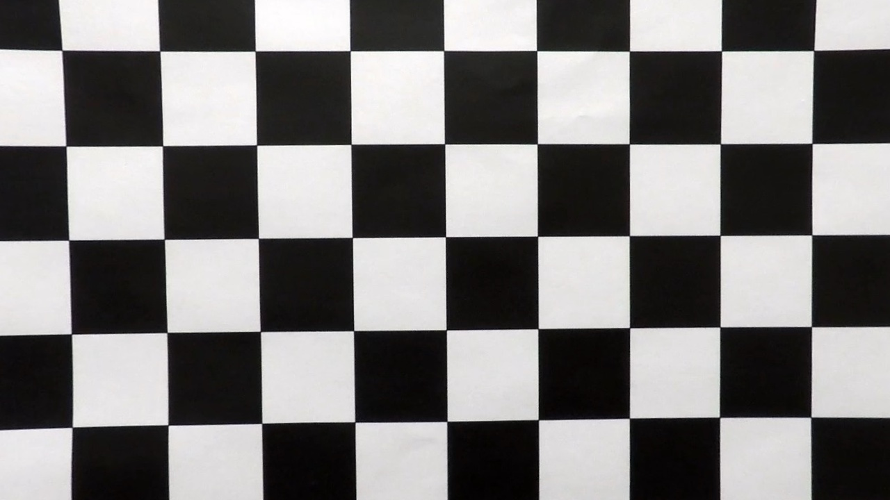
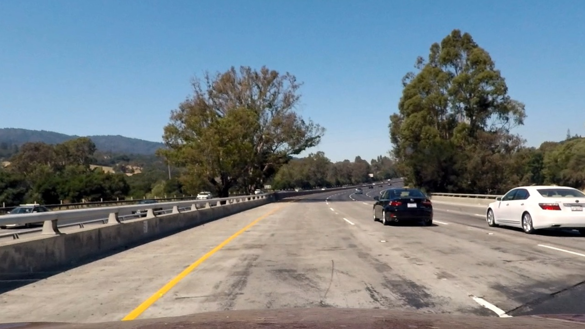
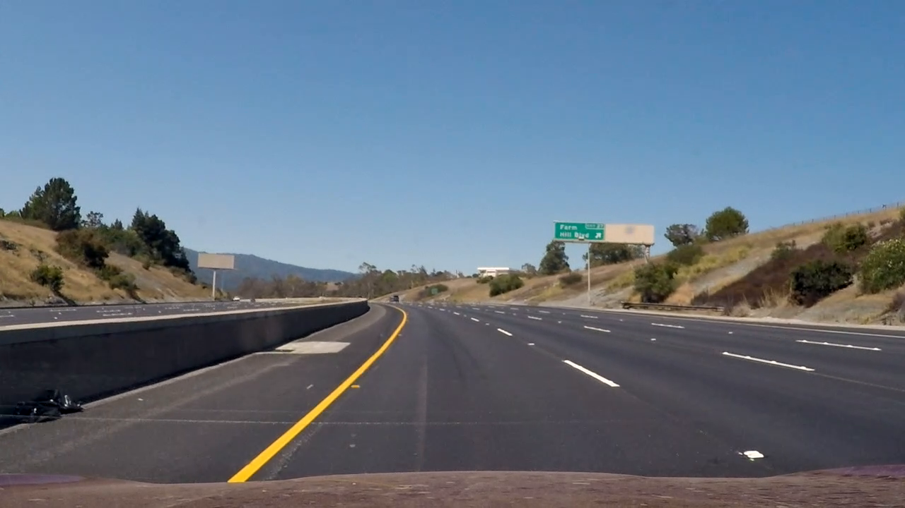
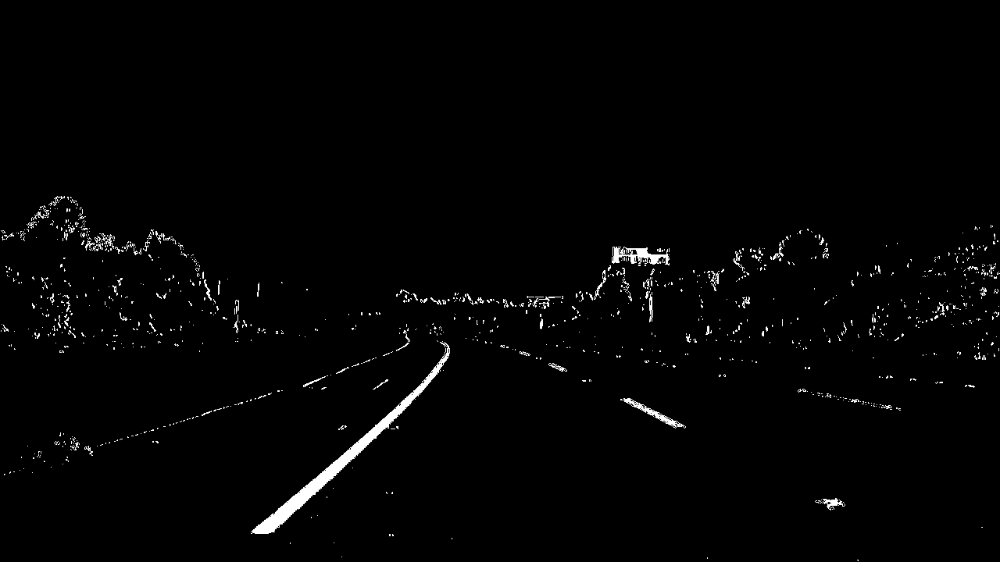
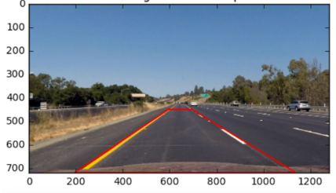
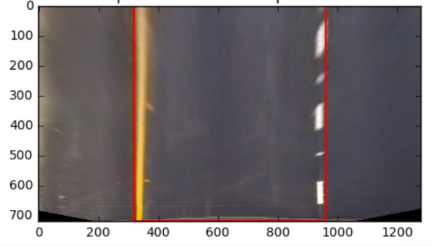
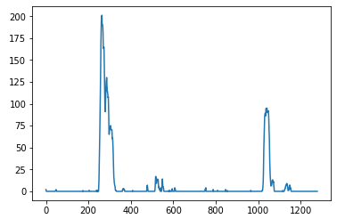
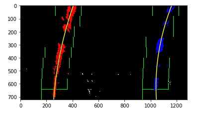
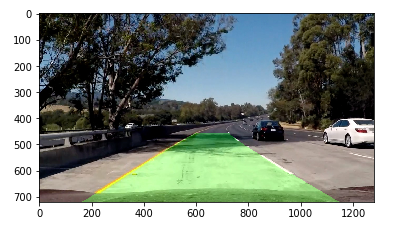

**Advanced Lane Finding Project**

The goals / steps of this project are the following:

* Compute the camera calibration matrix and distortion coefficients given a set of chessboard images.
* Apply a distortion correction to raw images.
* Use color transforms, gradients, etc., to create a thresholded binary image.
* Apply a perspective transform to rectify binary image ("birds-eye view").
* Detect lane pixels and fit to find the lane boundary.
* Determine the curvature of the lane and vehicle position with respect to center.
* Warp the detected lane boundaries back onto the original image.
* Output visual display of the lane boundaries and numerical estimation of lane curvature and vehicle position.

## [Rubric](https://review.udacity.com/#!/rubrics/571/view) Points

### Here I will consider the rubric points individually and describe how I addressed each point in my implementation.  

---

### Writeup / README

All code used in this project lives in the file `lanes.py` in the main project folder.

### Camera Calibration

#### 1. Briefly state how you computed the camera matrix and distortion coefficients. Provide an example of a distortion corrected calibration image.

The code for this step is contained in my `Camera` class (lines 86-138 in `lanes.py`).

I used very similar code from the main lecture: I stored `objpoints` and `imgpoints`
from the given calibration images to get the distortion coefficients. I subsequently 
use `cv2.calibrateCamera` and `cv2.undistrot` to get this result:

I then used the output `objpoints` and `imgpoints` to compute the camera calibration and distortion coefficients using the `cv2.calibrateCamera()` function.  I applied this distortion correction to the test image using the `cv2.undistort()` function and obtained this result: 

Distorted                     |  Undistorted
:----------------------------:|:------------------------------:
| 

### Pipeline (single images)

#### 1. Provide an example of a distortion-corrected image.

The first step is to undistort the image by applying the caclulated distortion coefficients
to the image:

Distorted                     |  Undistorted
:----------------------------:|:------------------------------:
| 

#### 2. Describe how (and identify where in your code) you used color transforms, gradients or other methods to create a thresholded binary image.  Provide an example of a binary image result.

I used a combination of color and gradient thresholds to generate a binary image (thresholding steps at lines 54 through 83 in `lane.py`).In particular I used the S and L channels in HSL in combination with gradient thresholding. I found that using the additional channel
made my pipeline better able to deal with shaded areas or when the lane color changes. I think incorporating more channels and thus more information
makes it more robust.  

Here's an example of my output for this step.  (note: this is not actually from one of the test images)

Source                  |  Binary
:----------------------------:|:------------------------------:
| 

#### 3. Describe how (and identify where in your code) you performed a perspective transform and provide an example of a transformed image.

The code for my perspective transform includes a class called `Perspective` with methods called `warp()` and `unwarp`, which appear in lines 141 through 173 in the file `lanes.py`. 
The `Perspective` class is initialized with source (`src`) and destination (`dst`) points.  I chose the hardcode the source and destination points in the following manner through
trial and error.

This resulted in the following source and destination points:

| Source        | Destination   | 
|:-------------:|:-------------:| 
| 253, 697      | 303, 697      | 
| 585, 456      | 303, 0        |
| 700, 456      | 1011, 0       |
| 1061, 690     | 1011, 690     |

I verified that my perspective transform was working as expected by drawing the `src` and `dst` points onto a test image and its warped counterpart to verify that the lines appear parallel in the warped image.

Source                  |  Destination
:----------------------------:|:------------------------------:
| 

#### 4. Describe how (and identify where in your code) you identified lane-line pixels and fit their positions with a polynomial?

I identifed lane-line pixels using the sliding histogram approach straight from the lecture in my
`fit_lines()` method (Lines 214 to 278)

 I initially found the
starting points by plotting pixel densities as a histogram to identify peaks:

Using a sliding window, I highlighted pixels within the windows as part of the lane. It looks like:

Once I identified the left lane in red and right lane in blue. I used those points 
to fit a 2nd degree polynomial. 

During the actual video however, I use a rolling average on the points.
Specifically, I take the average of the coefficients from the last 4 frames to smooth out
my lane lines. See `determine_fit_to_draw()` on lines 281 to 301 in `lanes.py`. Moreover,
if the fits did not pass a sanity check (i.e. the coefficients curvatures should be reasonably close)
I skip that frame.

#### 5. Describe how (and identify where in your code) you calculated the radius of curvature of the lane and the position of the vehicle with respect to center.

I did this in lines 30 through 40 in my code in the `compute_curvature()` function.

#### 6. Provide an example image of your result plotted back down onto the road such that the lane area is identified clearly.

I implemented this step in lines 304 through 332 in my code in my `Lines` class in the function `draw()`.  Here is an example of my result on a test image:

---

### Pipeline (video)

#### 1. Provide a link to your final video output.  Your pipeline should perform reasonably well on the entire project video (wobbly lines are ok but no catastrophic failures that would cause the car to drive off the road!).

Here's a [link to my video result](./lane_lines.mp4)

---

### Discussion

#### 1. Briefly discuss any problems / issues you faced in your implementation of this project.  Where will your pipeline likely fail?  What could you do to make it more robust?

Here I'll talk about the approach I took, what techniques I used, what worked and why, where the pipeline might fail and how I might improve it if I were going to pursue this project further.  

The preprocessing steps of undistorting and thresholding were relatively straightforward. I used very similar default parameters from Project 1. It was also
relatively straight forward to find sane thresholds through trial and error particularly on rough patches of road.

The most challenging part of the project was identifying the lane pixels. I used the sliding histogram approach straight from the lecture, but it was not smooth and suffered
on certain parts of the video. In order to deal with this problem, I decided to take the average of the past few frames to smooth out the transitions. Additionally, adding
logic to skip frames when the fit was bad helped a lot. 

I'm not particularly satisfied with how many frames I skipped, though. I skip a lot of frames on the dirt road and also, surprisingly, on parts where the road is completely
straight. When I debugged, I realized that my perspective transform was not particularly robust. On the straight roads, when I warped the image, my lines would not always be exactly parallel. I think hardcoding the source and destination points is really error prone. If I were to improve my project, I would spend more time looking for ways to automate the perspective transform.